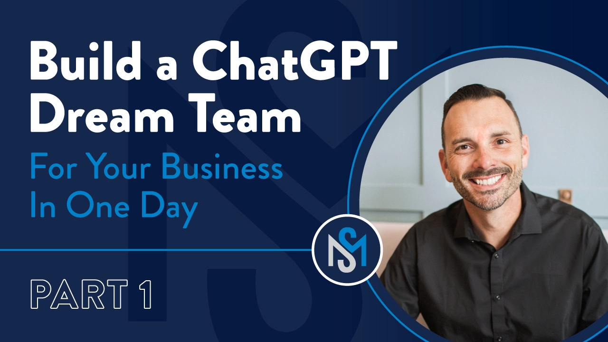
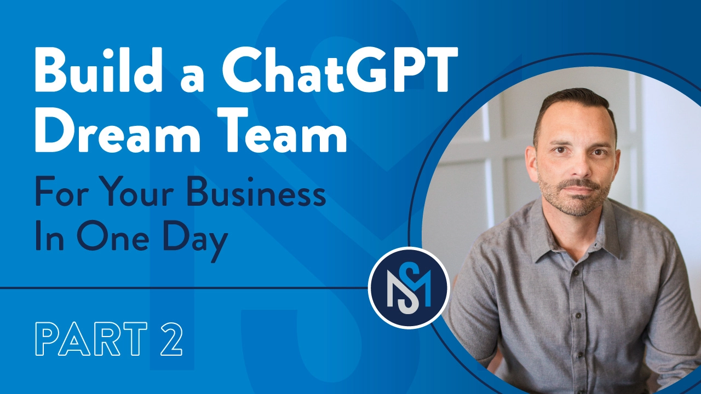
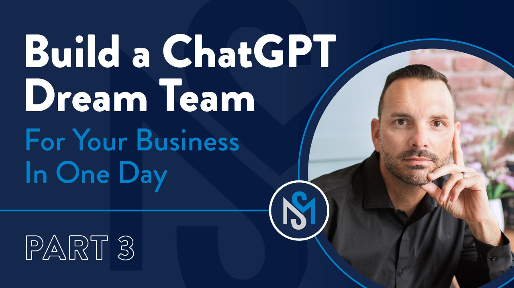
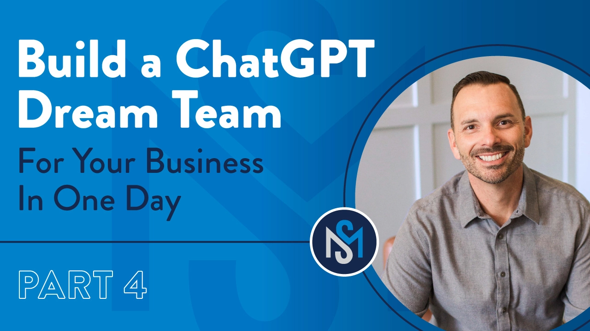

# 一天搭建你的AI团队:不需要懂技术的实战指南

企业AI应用正在改变工作方式。但大多数老板面对的问题是:怎么开始?需要多少预算?要不要招技术团队?其实,你只需要一个ChatGPT Teams账号和一天时间,就能搭建起10人规模的AI助手团队。本文会告诉你具体怎么做,没有空话,全是实操步骤。

---

我先说清楚一件事:

我不是AI专家。不是计算机科学家,也不是工程师。我只是个创业者。

我同时经营两家公司(还在折腾第三个),每天要处理的事情包括市场营销、招人、流程优化、还得让团队盯着长期目标不跑偏。当AI火起来的时候,我知道这玩意儿重要——但我也知道自己没时间变成"技术男"。

所以这篇文章?

它不是市面上唯一的AI指南。

但可能是最简单的那个。

这是我用来在公司内部搭建10个定制GPT"智能体"(后面统一叫"GPT")的方法,整个上线过程只用了几个小时。

接下来我会手把手教你怎么做同样的事。

你不需要AI博士学位。你只需要愿意搭个基本架构,想清楚自己的业务,然后快速行动。

这篇文章会给你:

- 我的内部部署框架(真的不到一天)
- 给整个系统"喂脑子"的2个主提示词
- 我在用的10个GPT(带名字和具体用途),外加20个你可能想试试的
- 可下载的模板和设置表
- 手把手视频教程,直接看着做

说到底,我对AI的态度很简单:**别被铺天盖地的信息搞晕。**

从你能控制、能用上的东西开始就行。

咱们开始干活。

## 第一步:先弄个ChatGPT Teams账号

在搭任何东西之前,确保你有ChatGPT Teams账号。(注意:这**不是**个人付费版。那是两码事。)

为什么这个重要:

- 一键就能在公司内部共享GPT
- 所有东西安全、有序、可控
- 不用因为员工离职就重新建GPT

这是基础。

👉 [想快速上手企业级AI应用?直接用ChatGPT TEAM会员 特价账号开始,省去繁琐的配置流程](https://shaoyumi.com/buy/65)

## 第二步:做两个"主提示词"

这是秘密武器。

在建任何GPT之前,你要先做两个主提示词,里面装着所有关于你和你公司的信息。这俩提示词就像"大脑",你所有的GPT都会调用它。

这种提示词也叫"上下文文档"(Context Documents),威力巨大,因为它给AI提供了"背景信息"。就好比你往AI里植入了组织的记忆,之后所有对话都会自带这些知识。挺酷的。

**主提示词1:关于你的公司**

核心业务信息,比如团队结构、运营系统(EOS或其他)、KPI、价值观、SOP、战略重点。

**主提示词2:关于你**

你是谁,喜欢怎么沟通,领导风格、偏好、目标,还有个人特点。

做一次,每月更新,你的GPT从此以后每次对话都会参考这些内容。

## 第三步:搭这10个GPT

每个名字我都用同样的格式:没空格,结尾带**AI**。(建系统的时候,一致性很重要。)

这是我的阵容:

**1. CFOAI**

预测现金流,建利润模型,准备财务审查。

**2. MarketerAI**

规划营销活动,写标题,头脑风暴内容。

**3. AttorneyAI**

初步审查合同,标记风险,起草简单政策。

**4. EOSAI**

准备L10会议,IDS总结,更新计分卡。

**5. HRAI**

职位描述,入职模板,文化契合度问题,DISC测评库。

**6. SalesManagerAI**

跟进邮件,处理异议训练,NSLI指标。

**7. OpsAI**

写SOP,审核工作流,发现低效环节。

**8. ContentAI**

代写通讯稿、社交媒体内容、LinkedIn轮播图。

**9. EAAI**

日程管理,差旅计划,会议记录。

**10. EventAI**

头脑风暴活动点子,生成议程,制定预算。

## 第四步:部署给你的团队

这套系统能在1天内上线并产生效果,几周内就能让团队完全上手。这是我用的推广计划:

**第1周:入门培训(60分钟)**

- 快速解释GPT是啥(以及它**不是**啥)
- 现场演示2-3个GPT的用法
- 说清楚:这是支持你的团队,不是取代他们(AI辅助 vs. AI优先)

**第2-3周:分配和测试**

- 在ChatGPT Teams工作区里分享GPT
- 给每个人分配1-2个GPT
- 收集使用效果、问题、建议
- 建个专门的沟通渠道(Slack、Google Spaces等)来支持这次推广
- 根据需要调整GPT的指令

**第4周及以后:持续检查**

- 每周15分钟GPT回顾
- 收集反馈,迭代提示词
- 往GPT的"知识"部分添加更多文件
- 鼓励小改进,不求完美

**每月:更新你的主提示词**

事情会变。每30天更新一次主提示词,包括:

- 新的团队角色
- 战略优先级
- 更好的表达方式

这能让你的GPT保持敏锐。把这些新提示词上传到每个GPT。每个60秒搞定。为了升级上下文,这点时间不算啥。

## 写在最后

这不是要替代人。

这是要扩展你团队的思考力、创造力和产出能力。

这些GPT帮我们动得更快、想得更清楚。

它们把我解放出来,让我能专注在只有我能做的事上:愿景、文化、战略。

最棒的部分?

我不用等什么5万美元的"AI转型"项目。

我在真实工作间隙花几个小时搭了这套系统,现在它已经在我们的业务里跑起来了。

👉 [准备好用AI给业务提速了吗?ChatGPT TEAM会员 特价账号让你今天就能开始搭建自己的AI团队](https://shaoyumi.com/buy/65)

---

不用被AI的复杂概念吓住。你需要的只是一个开始,一套能落地的工具,和快速行动的决心。按这个框架走,一天之内,你的AI助手团队就能开始干活。
